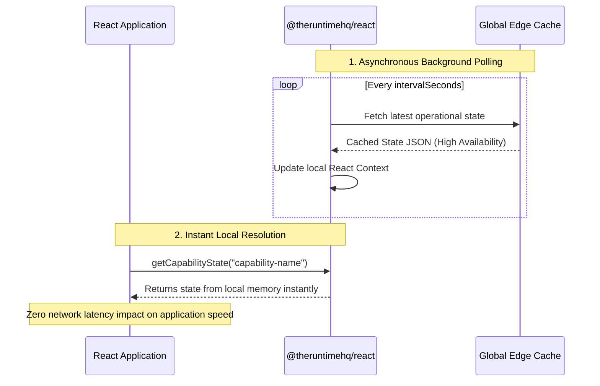

# @theruntimehq/react

[](https://www.npmjs.com/package/@theruntimehq/react)
[](https://github.com/TheRuntimeHQ/runtimehq-react/blob/main/LICENSE)

The official [Runtime React SDK](https://docs.theruntimehq.com/runtime-sdks/react) for [RuntimeHQ](https://theruntimehq.com). The SDK provides a context provider and hooks to easily consume the effective runtime state in your application components.

This SDK is a **pure state management SDK** with:
- 🚫 **No visual UI components** (Customers use their own design systems).
- 🚫 **No CSS, Tailwind, or style sheet dependencies**.
- 🚫 **No external state libraries**.
- ⚛️ Full support for **React 18+ and 19+**.
- 🌐 Native compatibility with Server-Side Rendering (SSR), Vite, Next.js, and Remix.

---

## Table of Contents

- [Installation](#installation)
- [Core Hooks & Provider APIs](#core-hooks--provider-apis)
  - [1. Global Provider (\`RuntimeHQProvider\`)](#1-global-provider-runtimehqprovider)
  - [2. Context Hook (\`useRuntimeHQ\`)](#2-context-hook-useruntimehq)
  - [3. Standalone Direct Hook (\`useRuntimeHQState\`)](#3-standalone-direct-hook-useruntimehqstate)
- [Convenience Helpers](#convenience-helpers)
- [State Resolution Architecture](#state-resolution-architecture)
- [Server Rendering (SSR) & Next.js App Router Integration](#server-rendering-ssr--nextjs-app-router-integration)
- [Examples Directory](#examples-directory)
- [License](#license)

---

## Installation

Ensure you have `@theruntimehq/js` and React installed in your project:

```bash
npm install @theruntimehq/react @theruntimehq/js
```

---

## Core Hooks & Provider APIs

### 1. Global Provider (`RuntimeHQProvider`)

Wrap your root application with the `RuntimeHQProvider`. It internally manages a single `RuntimeHQClient` and handles global state subscription and cleanup.

```tsx
import { RuntimeHQProvider } from "@theruntimehq/react";

export default function Root() {
  return (
    <RuntimeHQProvider 
      runtimeKey="rt_prod_your_key_here" 
      intervalSeconds={60}
    >
      <App />
    </RuntimeHQProvider>
  );
}
```

#### Provider Props
| Prop | Type | Required | Default | Description |
| :--- | :--- | :--- | :--- | :--- |
| `runtimeKey` | `string` | **Yes** | - | The [Runtime Key](https://docs.theruntimehq.com/runtime-keys) required to get the resolved operational state of the application's capabilities. This is a public, read-only key that is absolutely safe for client-side exposure or browser environments. |
| `intervalSeconds` | `number` | No | `60` | Configurable polling interval for updates in seconds. Defaults to 60 seconds. |

---

### 2. Context Hook (`useRuntimeHQ`)

Consume the global status state anywhere inside the provider.

```tsx
import { useRuntimeHQ, isOperational } from "@theruntimehq/react";

function StatusBanner() {
  const { runtime, loading, error } = useRuntimeHQ();

  if (loading) return <div>Checking status...</div>;
  if (error) return <div>Error fetching status: {error.message}</div>;
  if (!runtime || isOperational(runtime)) return null;

  return (
    <div className={`banner ${runtime.state.toLowerCase()}`}>
      ⚠️ {runtime.message}
    </div>
  );
}
```

#### Return Value
```typescript
interface RuntimeHQContextValue {
  runtime: RuntimeResponse | null; // Detailed status info or null before first fetch
  loading: boolean;                // true until the first fetch (success or failure) completes
  error: Error | null;             // Captured network or validation error (if any)
}
```

> [!IMPORTANT]
> If `useRuntimeHQ` is invoked outside a `<RuntimeHQProvider>`, it throws a descriptive error:
> `useRuntimeHQ must be used within a RuntimeHQProvider`

---

### 3. Standalone Direct Hook (`useRuntimeHQState`)

If you want to read runtime status inside isolated widgets without setting up a context provider at the root level, use `useRuntimeHQState`. It shares the same state management and cleanup logic as the provider.

```tsx
import { useRuntimeHQState } from "@theruntimehq/react";

function IndependentWidget() {
  const { runtime, loading, error } = useRuntimeHQState({
    runtimeKey: "rt_prod_your_key_here",
    intervalSeconds: 60,
  });

  if (loading) return <Spinner />;
  return <div>State: {runtime?.state}</div>;
}
```

---

## Convenience Helpers

Quickly determine states using utility checkers. These accept either the full `RuntimeResponse` object, a `CapabilityState` object, the `RuntimeState` string, or `null`/`undefined`.

```typescript
import { 
  isOperational, 
  isMaintenance, 
  isDegraded, 
  isOutage 
} from "@theruntimehq/react";

// Usage
isOperational(runtime)  // returns boolean
isMaintenance(runtime)  // returns boolean
isDegraded(runtime)     // returns boolean
isOutage(runtime)       // returns boolean
```

---

## State Resolution Architecture



---

## Server Rendering (SSR) & Next.js App Router Integration

To avoid layout shifts and flashes of loading states on initial load, fetch the status server-side using the underlying `@theruntimehq/js` SDK directly, and render a static warning component on the server:

```tsx
// src/app/page.tsx (Next.js Server Component)
import { RuntimeHQClient } from "@theruntimehq/js";
import ClientSidePoller from "./ClientSidePoller";

export default async function Page() {
  const client = new RuntimeHQClient({ runtimeKey: process.env.RUNTIMEHQ_KEY! });
  let initialRuntime = null;

  try {
    initialRuntime = await client.getRuntime();
  } catch (err) {
    // Fail-open: ignore server-side fetch errors during build/request
    console.error("Failed to check status during SSR:", err);
  }

  return (
    <main>
      {/* 1. SSR Static Layout (Zero layout shift on load) */}
      {initialRuntime && initialRuntime.state !== "OPERATIONAL" && (
        <div className="banner">
          ⚠️ {initialRuntime.message}
        </div>
      )}

      {/* 2. Client Side Poller (Handles live updates) */}
      <ClientSidePoller initialData={initialRuntime} />
    </main>
  );
}
```

```tsx
// src/app/ClientSidePoller.tsx (Client Component)
"use client";

import { useRuntimeHQState } from "@theruntimehq/react";
import type { RuntimeResponse } from "@theruntimehq/react";

interface ClientSidePollerProps {
  initialData: RuntimeResponse | null;
}

export default function ClientSidePoller({ initialData }: ClientSidePollerProps) {
  const { runtime } = useRuntimeHQState({
    runtimeKey: "rt_prod_your_key_here",
    intervalSeconds: 60,
  });

  // Hydrate client-side with server-fetched data initially
  const currentRuntime = runtime || initialData;

  if (!currentRuntime || currentRuntime.state === "OPERATIONAL") return null;

  return (
    <div className="interactive-status">
      Status is {currentRuntime.state} (Polled: {runtime ? "Yes" : "No"})
    </div>
  );
}
```

## Examples Directory

Check out the [examples directory](./examples) for common integration patterns:

| File Name | Business Outcome |
| :--- | :--- |
| `01-application-wide-banner.tsx` | Inform all users when the application is degraded, under maintenance, or unavailable. |
| `02-capability-outage-tooltip.tsx` | Explain why a specific feature is unavailable. |
| `03-feature-gating.tsx` | Hide unavailable functionality from users. |
| `04-disable-checkout-when-payments-down.tsx` | Prevent purchases when the payments capability is unavailable. |
| `05-disable-document-upload-during-maintenance.tsx` | Prevent uploads while the upload capability is under maintenance. |
| `06-read-only-mode-during-outage.tsx` | Keep the application usable while blocking write operations. |
| `07-degraded-experience-message.tsx` | Communicate reduced functionality without blocking users. |
| `08-runtime-status-indicator.tsx` | Show operational status in the application header, footer, or navigation. |
| `09-customer-facing-status-page.tsx` | Build a public status page powered by RuntimeHQ. |
| `10-runtime-aware-navigation.tsx` | Hide or disable navigation items for unavailable capabilities. |
| `11-runtime-aware-routing.tsx` | Prevent access to routes backed by unavailable capabilities. |
| `12-runtime-aware-redirection.tsx` | Automatically redirect users when a capability becomes unavailable. |
| `13-runtime-aware-fallback-route.tsx` | Redirect users to an alternative workflow when the primary capability is unavailable. |
| `14-outage-toast-notifications.tsx` | Notify users immediately when runtime state changes occur. |
| `15-runtime-dashboard.tsx` | Build an operational dashboard displaying application health and capability health. |
| `16-multi-application-operations-center.tsx` | Monitor multiple applications from a unified screen. |
| `17-runtime-aware-error-page.tsx` | Replace generic errors with operationally-aware messaging. |
| `18-runtime-aware-empty-state.tsx` | Show meaningful empty states when functionality is unavailable. |
| `19-maintenance-lock-screen.tsx` | Restrict access to workflows during active maintenance windows. |
| `20-live-system-health-widget.tsx` | Embed a reusable health widget anywhere in the application. |
| `21-production-ready-provider.tsx` | Complete production integration including provider setup, refresh handling, and resilience patterns. |

---

## License

MIT
